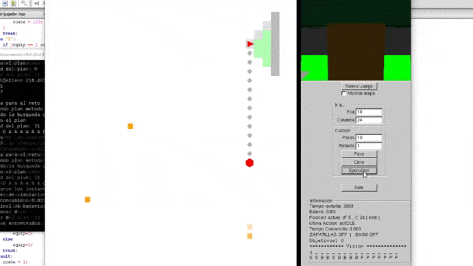

# Pathfinding
Used C++ for implementing searching algorithms( Informed, Blind and optimal such as A*) in a video-game which simulates a smart vacuum cleaner.

* It uses OpenGL for the graphic interview.
* The player has a quantity of movements and energy, these algorithms balance both things for getting the highest number of points in the map.
* In addition, there are some objects some training shoes or bathing suite in the map for expending less energy if water or countryside fields.
* This project uses differents data structures for optimizing the execution time of the algorithms. For example it uses queues, sets, arrays, lists, etc.

# How to Run

You need OpenBlocks to run this program. Go to File-->Open... and select "Belkan.cbp" 
After the proyect loads click the "Build and run" buttom.
A window will pop. Select "Nuevo Juego".
On Mapas you can choose from a variety of pre-built games to run the simulation.

<h6>Practica IA UGR 2019-2020<h6>
